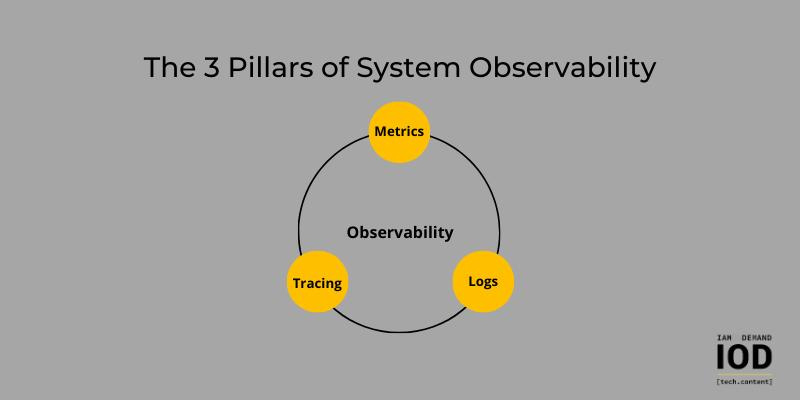
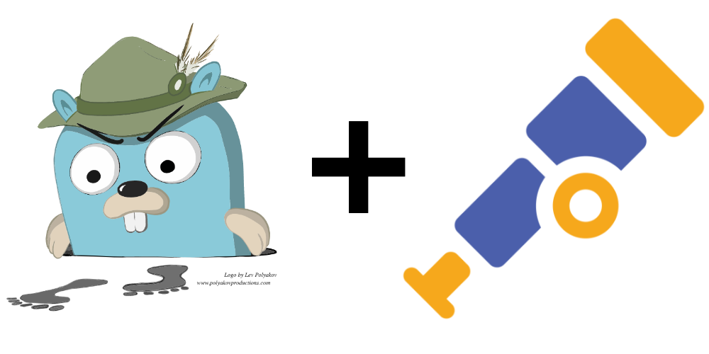
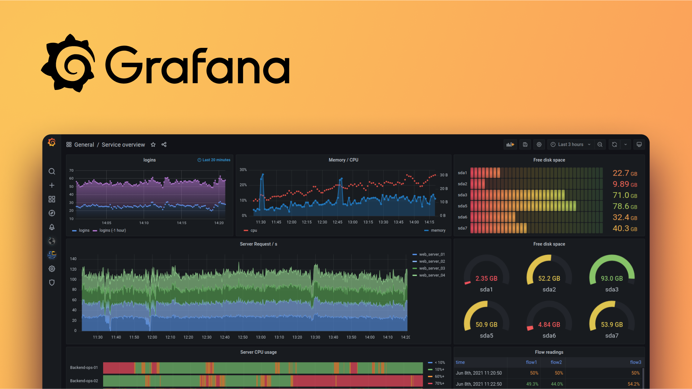

# How To Observe Distributed Systems 👁️‍🗨️

## What is Observability in Distributed Systems? 🔍

Observability in DevOps is the practice of gaining deep insights into the inner workings of a system by collecting and analyzing diverse data sources, such as logs, metrics, and traces.

### Advantages of Observability: 💎

1. **Proactive Issue Resolution:** Observability prevents potential issues by detecting anomalies early, ensuring stable system performance. 🚨
2. **Enhanced Debugging:** Observability streamlines debugging with detailed insights, minimizing downtime for issue resolution. 🛠️
3. **Efficient Troubleshooting:** Observability provides a comprehensive view, expediting issue isolation and resolution through streamlined data flow tracking. 🚀
4. **Cost Optimization:** Observability optimizes costs by analyzing resource usage, ensuring efficient allocation and reducing unnecessary expenses. 💰
5. **Compliance and Security:** Observability ensures compliance and security by continuously monitoring system behavior, proactively detecting incidents. 🔐

## Three Pillars of Observability:

The **three** pillars of observability are **logs, matrices, traces**. Let's understand them one by one.

## Metrics in Distributed Systems 📊

In distributed systems, metrics are numerical measurements that reveal how the system is performing and behaving. They provide insights into crucial aspects such as performance, health, and behavior. These measurements offer a clear, quantitative understanding of the system's state. By monitoring and analyzing these metrics, teams gain valuable information to ensure the system is running optimally and swiftly identify any potential issues.

Examples of using metrics in distributed systems include:

1. **CPU Usage:** Measures the percentage of CPU resources utilized by a node or component.
2. **Memory Usage:** Indicates the amount of memory consumed by a node or process.
3. **Network Throughput:** Quantifies the amount of data transmitted over the network within a given time frame.
4. **Latency:** Measures the time it takes for a request to travel through the system, providing insights into response times.
5. **Error Rates:** Tracks the frequency of errors or failures occurring in the system, helping in identifying and addressing issues.
6. **Request Rate:** Indicates the number of requests or transactions processed by the system per unit of time.

### Advantages of Metrics 😊

1. **Quantifiable Insight:** Metrics provide tangible, numerical data, offering a clear and quantifiable understanding of various aspects of a system's performance, health, and behavior.
2. **Proactive Issue Detection:** Monitoring metrics enables teams to proactively detect anomalies or deviations from expected behavior, allowing for early identification and resolution of potential issues before they impact system performance.
3. **Resource Allocation:** Metrics help in efficient resource allocation by providing data on resource usage patterns. This ensures that resources are distributed effectively, minimizing waste and optimizing costs.
4. **User Experience Enhancement:** Monitoring metrics related to response times and error rates allows teams to address issues affecting user experience promptly, ensuring a smoother and more reliable interaction for end-users.
5. **Efficient Troubleshooting:** When issues arise, metrics serve as valuable diagnostic tools. Teams can analyze relevant metrics to identify the root cause of problems quickly, streamlining the troubleshooting process.

  

> In upcoming blogs, We will use **Prometheus** for collecting metrics from **Kubernetes** pods.

## Logs in Distributed Systems 📜

In distributed systems, logs refer to chronological records of events, actions, or messages generated by various components or nodes within the system. These logs capture information, such as errors, warnings, transactions, and system activities, providing a detailed history of what has occurred.

Examples of using logs in distributed systems include:

1. **Error Logs:** Captures details about encountered errors, including error messages and stack traces, aiding in issue diagnosis.
2. **Access Logs:** Records details of system requests, such as source, requested resource, response codes, and timestamps, valuable for usage monitoring and security.
3. **Audit Logs:** Tracks security events, user activities, and system changes to ensure compliance and maintain system integrity.
4. **Transaction Logs:** Maintains a record of transaction progress across nodes, supporting data consistency and integrity.
5. **Security Logs:** Records security-related events like login attempts and unauthorized access, aiding in threat detection.

### Advantages of Logs 🎈

6. **Troubleshooting:** Logs facilitate troubleshooting by capturing information necessary for identifying the root cause of problems, streamlining the process of isolating and resolving issues.
7. **Historical Analysis:** Logs serve as a historical record of system activities, allowing teams to analyze trends, patterns, and changes over time. This historical perspective is valuable for understanding system behavior and performance evolution.
8. **Security Insights:** Security logs provide insights into security-related events, aiding in the detection of suspicious activities, unauthorized access attempts, and potential security threats.
9. **Compliance and Auditing:** Logs play a crucial role in compliance and auditing processes by documenting security events, configuration changes, and user activities, ensuring adherence to regulatory requirements.
10. **User Experience Improvement:** Access logs offer visibility into user interactions with the system, helping teams understand user behavior, identify usability issues, and enhance the overall user experience.
11. **Configuration Management:** Logs that track configuration changes assist in managing and understanding alterations to the system setup, supporting stability and ensuring accountability for modifications.
12. **Data Recovery:** Transaction logs can be essential for data recovery in the event of system failures or crashes, providing a means to reconstruct transactions and maintain data consistency.

  

> In upcoming blogs, We will use **Grafana Loki** for collecting logs from **Kubernetes** pods.

## Traces in Distributed Systems 🕵️‍♂️

In distributed systems, traces involve systematically recording and tracking the path of a transaction or request as it moves through different components or services. These traces offer a comprehensive, end-to-end perspective on the journey of a specific operation across various nodes. The purpose is to gain insights into dependencies, pinpoint performance bottlenecks, and assess the overall health of the distributed architecture.

Examples of using traces in distributed systems include:

1. **User Request Tracing:** Traces follow the path of a user request through microservices, databases, and caches, providing insights into end-to-end latency and dependencies.
2. **Transaction Tracing in Financial Systems:** Traces track the flow of a financial transaction across services, ensuring data consistency and reliability.
3. **E-commerce Order Processing:** Traces capture the processing of an e-commerce order, tracking it from placement to fulfillment, involving inventory, payment, and shipping services.
4. **API Gateway Tracing:** Traces in an API gateway provide visibility into how an API request is processed, authenticated, and forwarded to relevant backend services.

### Advantages of Traces

1. **End-to-End Visibility:** 
Traces provide a comprehensive view of a transaction's entire journey across various components, offering end-to-end visibility into system behavior.
2. **Troubleshooting Efficiency:** Traces streamline troubleshooting by offering a detailed record of a transaction's path, enabling teams to quickly identify and resolve issues.
3. **Integration with Observability:** Traces integrate seamlessly with other observability pillars like logs and metrics, providing a holistic view of the distributed system and enhancing overall monitoring capabilities.
4. **Proactive Performance Profiling:** Traces contribute to proactive performance profiling, highlighting the time spent in each component or service. This aids in optimizing resource allocation and improving overall system efficiency.
5. **Improved User Experience:** Traces, especially in access paths, optimize user experience by identifying and addressing latency issues, ensuring a smooth flow of user requests through various services.

  

> In upcoming blogs, We will use **Jaeger** for collecting traces from **Kubernetes** pods.

## Data Visualization In Distributed Systems 📈

Data visualization in distributed systems involves representing complex data and system-related information collected from **logs, matrices, traces** in a **visual format** that is easy to understand.

Tools for Data visualization are **Grafana, Kibana, Datadog, InfluxDB, Dynatrace, New Relic, Splunk, etc.**

  

> In upcoming blogs, We will use **Grafana** for data visualization.

## Conclusion

Stay tuned for more insightful content and practical guides on metrics, logs, traces, and data visualization tools. Your journey towards a more observable and optimized distributed system begins here. Dive in, implement best practices, and elevate your system's reliability and efficiency. **Happy observing!** 🌌🌟