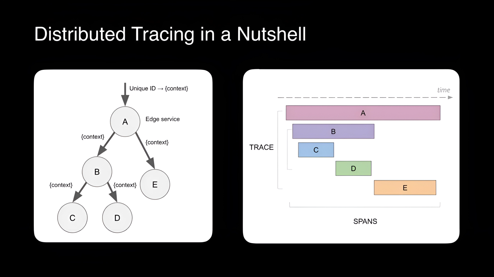
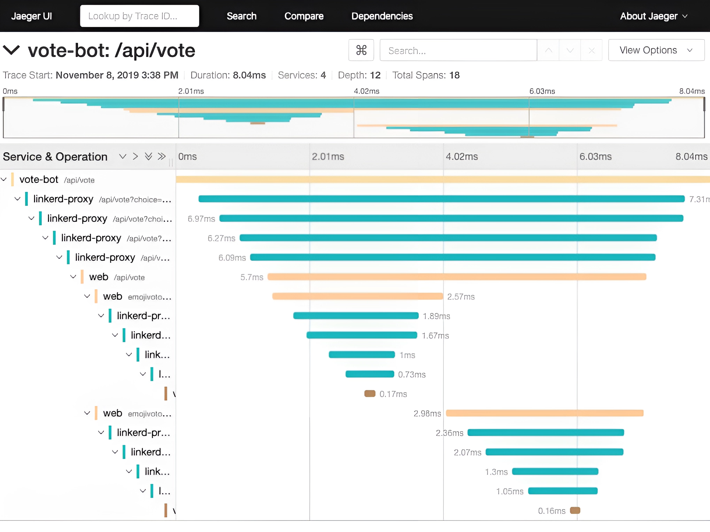

Today's software landscape demands **rapid innovation** and **flexible solutions**. Traditional monolithic architectures often struggle to keep pace with evolving business needs, hindering growth and adaptability. The **microservices architecture** emerges as a powerful alternative, offering numerous benefits for modern software development.

Microservices decompose applications into **smaller, independent services**, each focused on a specific business capability. This modular approach enables:

- **Faster development and deployment:** Teams can work and release individual services independently, accelerating development cycles.
- **Enhanced scalability:** Services can be scaled individually based on their specific needs, ensuring efficient resource utilization.
- **Improved fault isolation:** Issues within one service have minimal impact on others, maintaining overall application resilience.
- **Greater developer productivity:** Smaller codebases foster deeper ownership and agility within development teams.

## Monitoring Challenges in Microservices Environments 🧐

Monitoring a microservices-based application presents challenges due to its distributed and intricate structure. Illustrated below is the topology of Uber's microservices, where nodes represent services interconnected by lines. A single user action can trigger a request spanning **hundreds** of these nodes.

Conventional monitoring tools struggle with such distributed systems. They offer insights into aggregated metrics of individual application instances but lack the context for troubleshooting microservices environments.

For instance, diagnosing a **slow user request** in a microservices application remains elusive with traditional monitoring tools. To debug effectively, a comprehensive understanding of how a user request traversed all nodes is indispensable. **Distributed tracing** emerges as the prime technology to address this need.

## What is Distributed Tracing? 🔍
Distributed Tracing is a method of **monitoring and visualizing interactions** between components in a **distributed software system**. It allows **tracking** the flow of requests as they traverse various services, providing insights into performance **bottlenecks** and facilitating **troubleshooting** in complex, interconnected architectures.

## How Distributed Tracing Work? 🤔
Distributed tracing operates by injecting context into requests and leveraging that context to reconstruct the complete execution path across a landscape of microservices. 

Here's a breakdown of its operation:

### 1. Trace Initiation: 🚀

* A unique **trace ID** is generated upon receiving a user request, either by the initial service or a dedicated tracing agent. This ID serves as the central thread that connects all subsequent spans.

### 2. Span Creation: 🌐

* Each microservice involved in processing the request creates a **span**, a lightweight data structure encapsulating:
    * **Trace ID:** Links the span to the overall request journey.
    * **Span ID:** Uniquely identifies the span within the trace.
    * **Parent span ID:** (Optional) Identifies the preceding span if the request originated from another service.
    * **Span name:** Descriptive name of the operation performed by the service.
    * **Start and end timestamps:** Captures the processing duration of the request within the service.
    * **Additional data:** (Optional) Includes details like error codes, custom annotations, or service-specific metrics.

### 3. Context Propagation: 🔄

* The trace ID and, if applicable, the parent span ID are **propagated** along with the request to subsequent services. This ensures all involved services contribute to the overall trace and their spans are correctly linked.
* Common propagation methods include:
    * **HTTP headers:** Injecting trace and parent IDs into specific headers.
    * **Messaging queues:** Embedding IDs as part of the message payload.
    * **Distributed tracing libraries:** Integrating dedicated libraries that handle context propagation automatically.

### 4. Centralized Collection: 🗃️

* **Distributed tracing systems** (e.g., Zipkin, Jaeger) act as central repositories for the collected spans. These systems are responsible for:
    * **Receiving spans** from various sources like instrumentation libraries or agents embedded in microservices.
    * **Validating and storing** the received spans.
    * **Aggregating and analyzing** the collected data to extract meaningful insights.

### 5. Visualization and Analysis: 📊

* **Visualization tools** translate the aggregated span data into a human-readable format, such as **flame charts**. These charts depict the complete request flow, highlighting:
    * The sequence of service calls involved.
    * The relative duration of each service's processing.
    * Potential bottlenecks or performance issues within individual services.

**Here is one example of context propagation using Jaeger UI**

## Distributed Tracing vs. Logging: Key Differences 👁

**Distributed tracing** maps **entire request journeys** across microservices, pinpointing bottlenecks and errors. **Logging** focuses on capturing **specific events** for debugging, monitoring, and compliance.

#### Granularity:

* **Tracing:** High - pinpoints exact issues.
* **Logging:** Low - provides general information.

#### Data:

* **Tracing:** Large volume, challenging to manage.
* **Logging:** Smaller volume, easier to handle.

#### Use Cases:

* **Tracing:** Bottleneck identification, error debugging, system health.
* **Logging:** Code debugging, system monitoring, compliance.

**Remember:** Distributed tracing is like mapping a full road trip, while logging is like taking key moment photos. Both are valuable for comprehensive application monitoring and troubleshooting.

## Benefits of Distributed Tracing 🚀
According to a survey conducted by **O’Reilly in 2020, 61 percent of enterprises use microservice architecture**. As that number grows, so does the need for distributed tracing and improved observability. Frontend engineers, backend engineers, and site reliability engineers use distributed tracing to achieve the following benefits:

#### 1. Root Cause Analysis:
- When issues arise, distributed tracing helps in **pinpointing** the root causes of problems. Developers can **trace the path of a request** through various services, identify where errors or delays occurred, and quickly address the specific issues causing disruptions.🎯

#### 2. Reduced Mean Time to Resolution (MTTR):
- With detailed insights into the system's behavior, distributed tracing significantly reduces the **time required to identify, troubleshoot, and resolve issues**. This is crucial for minimizing downtime and ensuring a more responsive and reliable application.⏱️

#### 3. Capacity Planning and Scalability:
- By analyzing trace data, organizations can make informed decisions about capacity planning and scalability. They can **identify service-specific resource usage**, predict future needs, and scale individual components as necessary to handle increasing loads.📈

#### 4. Improve collaboration and productivity
- In microservice architectures, different teams may own the services that are involved in completing a request. Distributed tracing makes it clear where an error occurred and **which team is responsible for fixing it**.👩‍💻

#### 5. Maintain Service Level Agreements (SLAs)
- Most organizations have SLAs, which are **contracts with customers or other internal teams** to meet performance goals. Distributed tracing tools aggregate performance data from specific services, so teams can readily evaluate if they’re in compliance with SLAs.📝

## Challenges of Distributed Tracing 🛑

Despite the above advantages, there are some challenges associated with the implementation of distributed tracing:

#### 1. Instrumentation Overhead:
- The process of instrumenting applications to generate trace data can introduce overhead, impacting the performance of the system. Developers need to carefully balance the level of instrumentation to avoid degrading the application's responsiveness.🛠️

#### 2. Data Volume and Storage:
- Distributed systems generate a vast amount of trace data, and storing and managing this data can become a significant challenge. Organizations need robust storage solutions and strategies for handling the volume of trace information efficiently.💾

#### 3. Resource Intensive:
- The processing, storage, and transmission of trace data can be resource-intensive, particularly in large-scale systems. This resource consumption can impact the overall cost of infrastructure and may require careful optimization. ⚙️

## Conclusion 🌟
In today's fast-paced software world, microservices and distributed tracing are game-changers. Though there are hurdles like setting up tools and managing data, the rewards of solving issues quickly and scaling easily make it worth it. So, embrace the challenge and enjoy the journey of innovation! 🚀